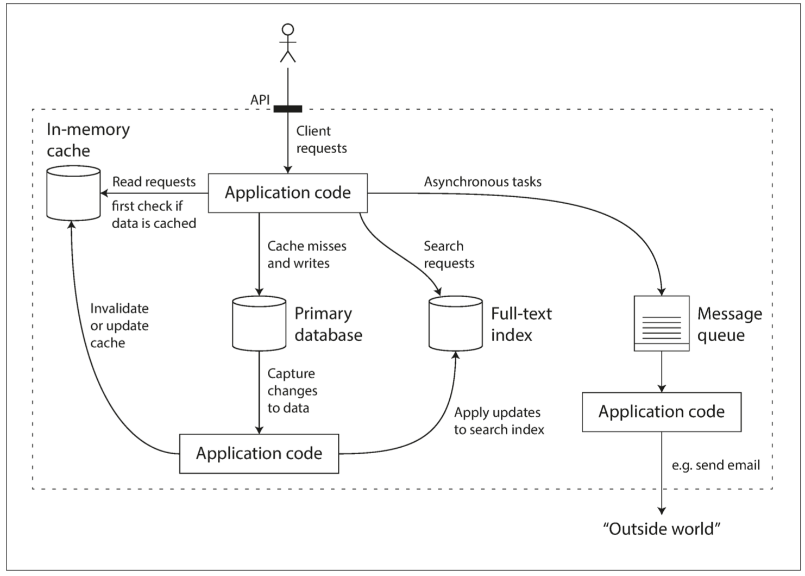

# 第一章 可靠性、可扩展性 和 可维护性

## 概念

当今很多应用程序都是数据密集型( **data-intensive** )的，而非计算密集型( **compute-intensive** )的。

典型的数据密集型应用通常由许多标准组件构成，这些标准组件提供的功能如下：

- 数据库：存放数据的地方，以便各个应用可以访问到数据
- 缓存：记住一些开销昂贵的操作的结果，以加快读取速度
- 搜索索引：允许用户根据关键字查询，搜索数据，过滤各种数据
- 流处理：向其他进程发送消息，进行异步处理
- 批处理：定期处理大批量累积的数据
- 等...

一个可能的由多个组件构成的数据系统的架构如下，其中包括：数据库、缓存、全文搜索、消息队列......

## 可靠性

对于软件来说，可靠性意味着：

- 应用程序表现出用户所期望的功能
- 允许用户犯错，或以不当的方式使用软件
- 在预期的负载和数据量的情况下，表现出良好的性能
- 能防止未经授权的访问和滥用

故障不等同失效。

- 故障( **fault** )：系统的一部分状态偏离其标准

- 失效( **failure** )：系统作为一个整体，停止向用户提供服务

可以恢复的故障种类有：

- 硬件故障：硬盘的平均故障时间(**MTTF**：mean time to failture) 约为 10 年到 50 年
- 软件错误
- 人为错误

## 可扩展性

可扩展性：用来描述系统应对负载增长能力的术语

可扩展性不是空谈的，可以从如下问题着手：

- 如果系统以特定方式增长，如何应对这种增长？
- 如何增加计算资源来处理额外的负载？

## 可维护性